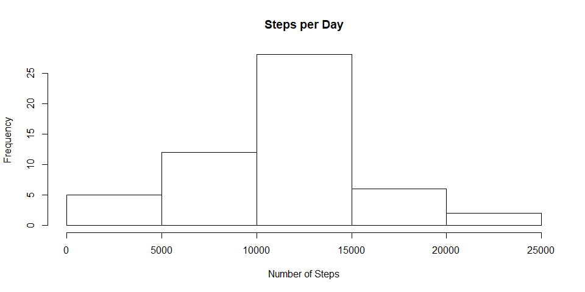
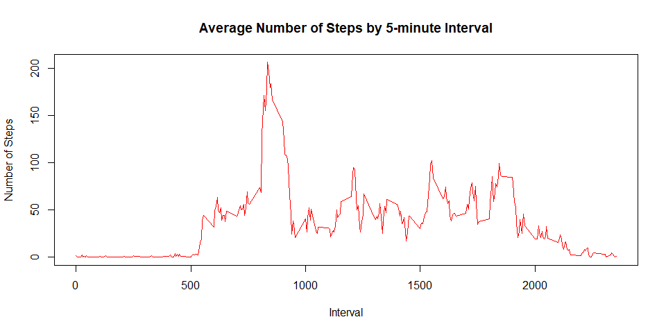
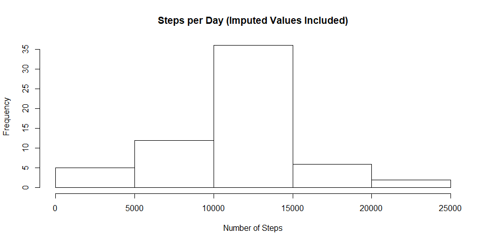
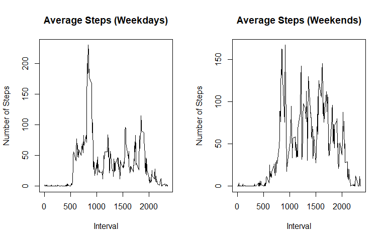

The data for this assignment can be downloaded from here:
https://d396qusza40orc.cloudfront.net/repdata%2Fdata%2Factivity.zip

Dataset: Activity monitoring data [52K]
The variables included in this dataset are:

steps: Number of steps taking in a 5-minute interval (missing values are coded as \color{red}{\verb|NA|}NA)
date: The date on which the measurement was taken in YYYY-MM-DD format
interval: Identifier for the 5-minute interval in which measurement was taken
The dataset is stored in a comma-separated-value (CSV) file and there are a total of 17,568 observations in this dataset.

## Unzip and load Activity Monitoring Data into R

```r
unzip("activity.zip")
actData <- read.csv("activity.csv", header = T)
```


## Q1 What is mean total number of steps taken per day?


```r
stepsDay <- tapply(actData$steps, actData$date, sum)
```

### Histogram output for steps taken per day

```r
hist(stepsDay, xlab = "Number of Steps", breaks = 5, main = "Steps per Day")
```

<!-- -->


### Calculate and report the mean and median of the total number of steps taken per day

```r
meanStepsPerDay <- mean(stepsDay, na.rm = T)
medianStepsPerDay <- median(stepsDay, na.rm = T)
```
The average number of steps for each day is 10766.1886792 steps.
The median number of steps for each day is 10765 steps.

## Q2 What is the average daily activity pattern?

### Make a time series plot (i.e. \color{red}{\verb|type = "l"|}type="l") of the 5-minute interval (x-axis) and the average number of steps taken, averaged across all days (y-axis)


```r
stepsInterval <- tapply(actData$steps, actData$interval, mean, na.rm = T)
plot((names(stepsInterval)), stepsInterval, xlab = "Interval", 
     ylab = "Number of Steps",
     type = "l",
     col = "Red",
     main = "Average Number of Steps by 5-minute Interval")
```

<!-- -->

### Which 5-minute interval, on average across all the days in the dataset, contains the maximum number of steps?


```r
df <- data.frame(names(stepsInterval), stepsInterval)
names(df)[names(df)=="names.stepsInterval"] <- "interval"
names(df)[names(df)=="stepsInterval"] <- "steps"
maxSteps <- max(df$steps)
maxInterval <- df[df$steps==maxSteps,1]
```

The 5-minute interval 835 had the maximum number of steps at 206.1698113


## Q#3 Imputing missing values
### Calculate and report the total number of missing values in the dataset (i.e. the total number of rows with \color{red}{\verb|NA|}NAs)


```r
missValues <- sum(is.na(actData$steps))
```

The total number of missing values for the activity dataset is 2304 

### Devise a strategy for filling in all of the missing values in the dataset. The strategy does not need to be sophisticated. For example, you could use the mean/median for that day, or the mean for that 5-minute interval, etc.


I will use the mean number of steps by the 5-minute interval across all days to fill in missing data.

### Create a new dataset that is equal to the original dataset but with the missing data filled in.

```r
library(dplyr) # import dplyr library
intervalSteps <- tapply(actData$steps, actData$interval, mean, na.rm = T) 
# calculate means for each interval used to substitute for NA values.
actData.imputed <- actData %>% 
        mutate(steps.imputed = ifelse(is.na(steps), intervalSteps, steps))
# create new variable for the imputed data
actData.imputed <- actData.imputed[order(actData.imputed$date),]
# sort data by date
```

### Make a histogram of the total number of steps taken each day and Calculate and report the mean and median total number of steps taken per day. Do these values differ from the estimates from the first part of the assignment? What is the impact of imputing missing data on the estimates of the total daily number of steps?


```r
stepsDay.imputed <- tapply(actData.imputed$steps.imputed, actData.imputed$date, sum)
hist(stepsDay.imputed, xlab = "Number of Steps", breaks = 5, main = "Steps per Day (Imputed Values Included)")
```

<!-- -->

```r
meanStepsPerDay.imputed <- mean(stepsDay.imputed, na.rm = T)
medianStepsPerDay.imputed <- median(stepsDay.imputed, na.rm = T)
```
The mean steps per day is 10766.1886792 
The median steps per day is 10766.1886792
The mean remained the same after the imputed values were included in the calculation but the median value increased slightly.  

## Q#4 Are there differences in activity patterns between weekdays and weekends?

### Create a new factor variable in the dataset with two levels – “weekday” and “weekend” indicating whether a given date is a weekday or weekend day.


```r
actData.imputed$day <- ifelse(weekdays(as.Date(actData.imputed$date))
                              %in% c("Saturday", "Sunday"), "weekend", "weekday")
```


#### Make a panel plot containing a time series plot (i.e. \color{red}{\verb|type = "l"|}type="l") of the 5-minute interval (x-axis) and the average number of steps taken, averaged across all weekday days or weekend days (y-axis). See the README file in the GitHub repository to see an example of what this plot should look like using simulated data.


```r
stepsDay.weekday <- tapply(actData.imputed[actData.imputed$day=="weekday",]$steps.imputed,
                           actData.imputed[actData.imputed$day=="weekday",]$interval,
                           mean, na.rm = T)
stepsDay.weekend <- tapply(actData.imputed[actData.imputed$day=="weekend",]$steps.imputed,
                           actData.imputed[actData.imputed$day=="weekend",]$interval,
                           mean, na.rm = T)

par(mfrow = c(1,2))

plot(as.numeric(names(stepsDay.weekday)), stepsDay.weekday,
     xlab = "Interval",
     ylab = "Number of Steps",
     main = "Average Steps (Weekdays)",
     type = "l")
plot(as.numeric(names(stepsDay.weekend)), stepsDay.weekend,
     xlab = "Interval",
     ylab = "Number of Steps",
     main = "Average Steps (Weekends)",
     type = "l")
```

<!-- -->

More steps on average were taken during the weekend than the weekdays.  
